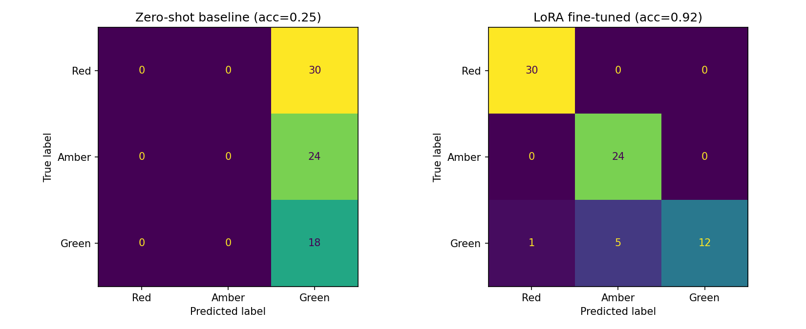

# Clause Risk Fine-Tune

Does fine-tuning a small LLM beat just prompting it? This project fine-tunes Qwen2.5-0.5B-Instruct with LoRA to classify contract clauses as Red / Amber / Green risk, then compares it against the exact same base model zero-shot prompted for the identical task — same architecture, same inference cost, so the only variable is whether the ~450 labeled training examples actually helped.

This is a follow-up to [clauseguard](https://github.com/naresh25peta-cell/clauseguard), which prompts a larger model to do the same rating task. The question here is narrower and more concrete: for a narrow, well-defined classification task, can a tiny fine-tuned model match or beat prompting, at a fraction of the size?

## Dataset

580 synthetic contract clauses across 12 categories (liability, termination, force majeure, payment, confidentiality, indemnification, IP, warranty, dispute resolution, assignment, governing law, data protection), each generated from a Red/Amber/Green template with randomized parties, amounts, and deadlines for surface variety. Labels are correct by construction — a clause is Red because it came from the Red template, not because a human or LLM judged it afterward. That removes label noise as a confounding factor when measuring the fine-tuning effect.

```bash
python generate_dataset.py
```

Writes `data/clauses.jsonl` plus a stratified 80/10/10 train/val/test split.

## Running the fine-tune

Everything — dataset generation, baseline evaluation, LoRA fine-tuning, and comparison — runs in one notebook: `notebooks/clause_risk_finetune.ipynb`. Open it in [Google Colab](https://colab.research.google.com/), set the runtime to a free T4 GPU (Runtime > Change runtime type), and run all cells top to bottom. No file uploads needed — the dataset is generated inline.

The notebook is generated from `notebooks/build_notebook.py`, which keeps the cell source as plain, diffable Python instead of raw notebook JSON.

## What it measures

1. **Zero-shot baseline**: prompt the untouched base model with each test clause, parse its Red/Amber/Green answer, measure accuracy.
2. **LoRA fine-tune**: train a LoRA adapter (rank 16) on the training split for 3 epochs.
3. **Same evaluation, fine-tuned model**: identical test set, identical prompt, identical model size — only the weights differ.

## Results

Run on a free Colab T4 GPU, 72 held-out test clauses:

| | Accuracy | Time (72 examples) |
|---|---:|---:|
| Zero-shot baseline | 25.0% | 11.4s |
| LoRA fine-tuned | 91.7% | 11.0s |
| **Improvement** | **+66.7 pp** | ~same |

Inference cost is essentially identical between the two — same model, same size, same forward pass. The entire gap is what the ~450 training examples taught it.

The baseline's 25% isn't "not great," it's a model that has collapsed to always guessing Green: 0% recall on both Red and Amber. Fine-tuning fixes that completely for Red and Amber (100% recall each) and gets Green mostly right, with the remaining errors split between Red and Amber rather than reversed:



| Class | Baseline recall | Fine-tuned recall | Fine-tuned precision |
|---|---:|---:|---:|
| Red | 0% | 100% | 97% |
| Amber | 0% | 100% | 83% |
| Green | 100% | 67% | 100% |

The one weak spot: 6 of 18 Green clauses get misclassified (1 as Red, 5 as Amber) — the fine-tuned model leans toward flagging risk when unsure, rather than defaulting to "acceptable." For a risk-scanning task that's arguably the safer failure mode, but it's a real gap, not a clean sweep.

## Using the trained adapter

The actual trained LoRA adapter from the run above is included in `adapter/` (fp16, ~4.2MB — small enough to check into git since it's just the low-rank matrices, not the full model). To load it:

```python
from transformers import AutoModelForCausalLM, AutoTokenizer
from peft import PeftModel

base = AutoModelForCausalLM.from_pretrained("Qwen/Qwen2.5-0.5B-Instruct")
tokenizer = AutoTokenizer.from_pretrained("Qwen/Qwen2.5-0.5B-Instruct")
model = PeftModel.from_pretrained(base, "adapter")
```

The tokenizer isn't included since fine-tuning didn't change it — load it from the base model directly, as above.

## Why this comparison design

A common mistake in "fine-tuning vs. prompting" comparisons is changing two things at once — e.g. comparing a fine-tuned small model against a prompted *large* model. That conflates model size with the fine-tuning effect. Here, both arms use the identical 0.5B model and identical inference cost, so any accuracy difference is attributable to the ~450 training examples, not to a bigger model doing the work.

## Tools

Python, PyTorch, Hugging Face Transformers, PEFT (LoRA), scikit-learn, Google Colab (free T4 GPU).

## Limitations

- Synthetic, template-generated data — real-world contract language is messier and less separable than these templates. This measures fine-tuning's effect on a clean task, not real-world MSA review accuracy.
- 580 examples is small by fine-tuning standards; the comparison is meant to be illustrative and reproducible on free compute, not a production-scale result.
